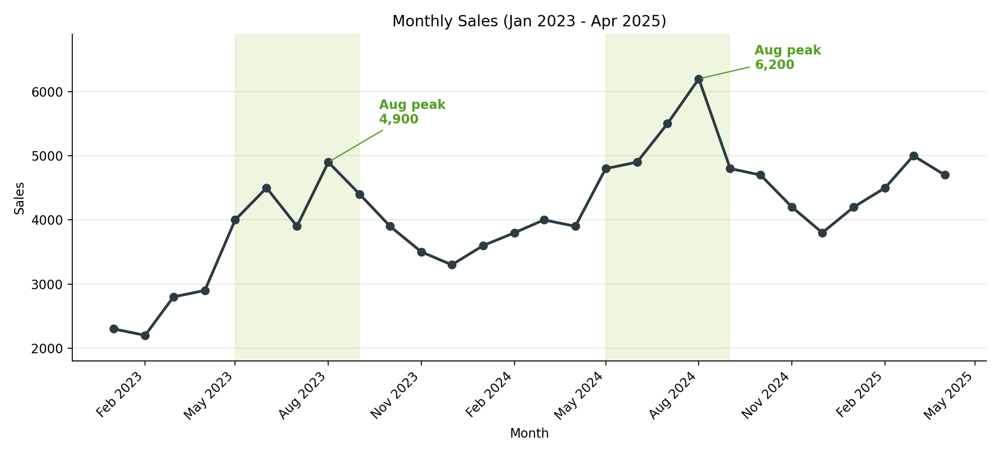
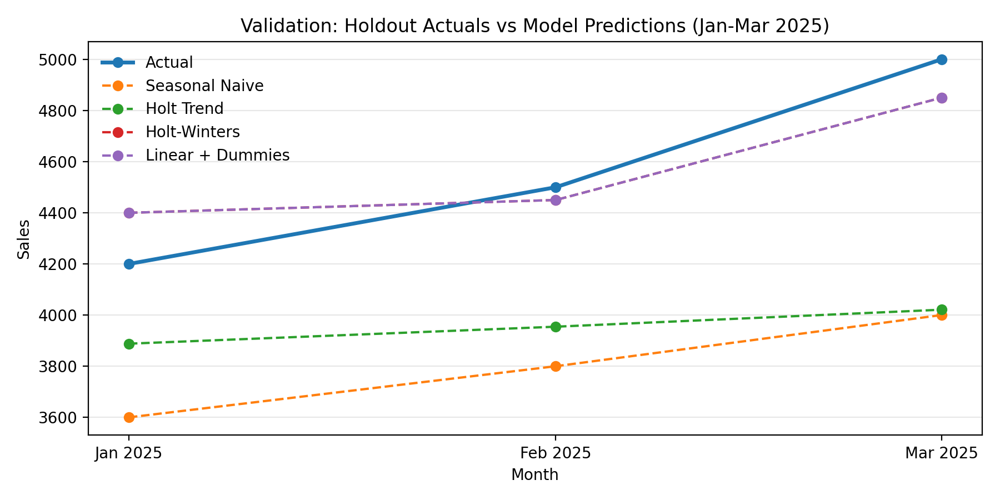
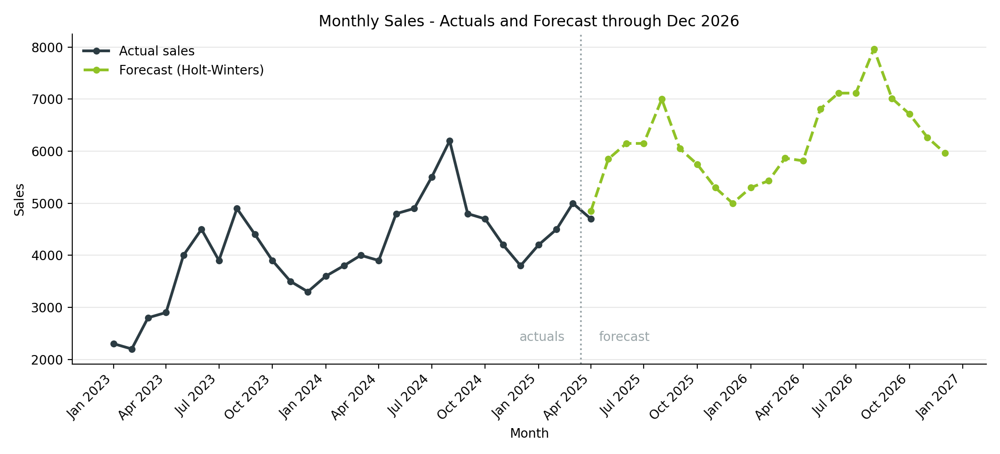

# Monthly Sales Forecasting & Trend Analysis

Time-series analysis of 28 months of company sales data (Jan 2023 - Apr 2025), including
trend/seasonality analysis, a 4-model forecasting comparison, and a 21-month forecast
through December 2026.

## What this project does

1. **Data quality checks** - validates the monthly series for gaps, duplicates, and
   negative/missing values.
2. **Trend & seasonality analysis** - month-over-month and year-over-year growth,
   rolling averages, and a visual read of the seasonal pattern.
3. **Model comparison** - four forecasting approaches are trained on 24 months and
   validated against a 3-month holdout (Jan-Mar 2025):
   - Seasonal Naive (baseline)
   - Holt's Linear Trend
   - Holt-Winters Additive (trend + seasonality)
   - Linear Regression with month dummy variables
4. **Final forecast** - the best-performing model is retrained on all available data
   and used to forecast sales through December 2026.
5. **Sensitivity check** - tests whether including one additional month of data
   meaningfully changes the forecast.

## Key results

| Model | MAE | RMSE | MAPE |
|---|---|---|---|
| **Holt-Winters Additive** | 133.3 | 147.2 | **2.96%** |
| Linear Trend + Month Dummies | 133.3 | 147.2 | 2.96% |
| Holt Linear Trend | 612.1 | 671.7 | 13.04% |
| Seasonal Naive | 766.7 | 785.3 | 16.61% |

Holt-Winters (additive trend, additive seasonality) was selected as the final model —
it ties for best validation accuracy, is easy to explain (level + trend + seasonal
effects), and its result is corroborated by an independent method (the regression)
landing on the same numbers.

**Forecast summary:**

| Period | Total Sales | Avg / Month | Growth vs. Prior Year |
|---|---|---|---|
| FY2024 (actual) | 54,200 | 4,517 | - |
| FY2025 (actual Jan-Mar + forecast) | 65,800 | 5,483 | +21.4% |
| FY2026 (forecast) | 77,400 | 6,450 | +17.6% |

Sales show a clear upward trend with a consistent seasonal pattern: a summer peak
(May-Sep, highest in August) and a winter trough (Nov-Feb).

## Visuals

**Historical sales with seasonal pattern**


**Model validation against holdout actuals**


**Forecast through December 2026**


## Repo structure

```
├── sales_forecasting_analysis.ipynb   # full analysis notebook
├── images/                            # exported charts
├── outputs/                           # generated CSV/XLSX results
│   ├── model_comparison.csv
│   ├── sales_forecast_through_dec_2026.csv
│   └── sales_forecast_output.xlsx
├── requirements.txt
└── README.md
```

## Tools & methods

Python, pandas, NumPy, statsmodels (Holt / Holt-Winters exponential smoothing),
scikit-learn (linear regression), matplotlib.

## Running it

```bash
pip install -r requirements.txt
jupyter notebook sales_forecasting_analysis.ipynb
```

## What would improve this forecast further

The notebook closes with a discussion of additional signals that would sharpen the
forecast in a real business setting: customer adds/churn, service-area capacity,
pricing and promotions, marketing spend, sales pipeline, and macro/seasonal factors
like weather and local employment.
